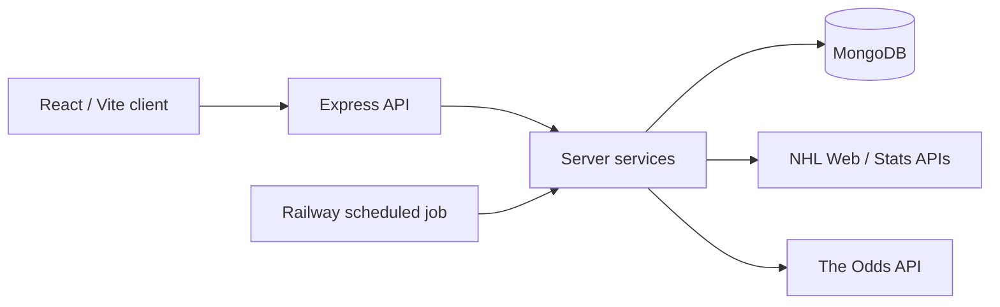

# NHL Edge


NHL Edge is a full-stack NHL analysis workspace. It combines account-owned team ratings and game context to estimate win probabilities and fair decimal odds, compare them with bookmaker moneylines, track bets, and evaluate predictions made before games.

**[Try the live app](https://nhl-edge-rouge.vercel.app)** → choose **Explore Demo** to open a temporary, seeded sandbox without registering.

React 19 + Vite 8 · Node.js 24 + Express 5 · MongoDB + Mongoose 9

## Engineering Highlights

- **One calculation core:** The browser and server share deterministic probability and market-comparison logic, keeping interactive analysis aligned with server-side calculations.
- **Frozen pregame forecasts:** Official T2 predictions are captured once with versioned inputs, so later rating or settings changes cannot rewrite the forecast being evaluated.
- **Honest evaluation paths:** Rating Lab replays historical games for research; Model Performance scores actual pregame captures against later results and paired market observations.
- **Isolated, writable demos:** Explore Demo creates a separate temporary account for each visitor, with seeded data and no entry into production prediction or odds-capture cohorts.
- **Auditable scheduled capture:** A Railway job coordinates Official T2, timed odds checkpoints, and demo cleanup; leases, game-identity checks, and capture records guard the observations.
- **Browser-level verification:** Playwright exercises demo entry, account isolation, sample performance, and Analyzer behavior against an ephemeral MongoDB replica set, alongside client and server tests.

## How NHL Edge Works

1. **Set team strength.** Each account maintains Power Ratings. Completed NHL results can update them through a deterministic engine with a per-game history.
2. **Analyze a matchup.** Game Analyzer combines those ratings with home advantage, injuries, schedule context, special teams, and optional manual inputs. It estimates win probabilities and fair odds; comparing them with market prices shows implied-probability edge and expected value.
3. **Decide and track.** Bookmaker preferences or a manually entered price support the comparison. Fractional-Kelly guidance is optional; Bet Tracker saves the placed price and model state, maintains a bankroll ledger, and can settle linked moneyline bets from results.
4. **Evaluate forward.** Scheduled Official T2 predictions are saved before games. Model Performance compares those frozen forecasts with outcomes and captured market prices.

NHL Edge reports model estimates and market comparisons; it does not claim a betting edge or guarantee profitable outcomes.

## Modeling & Forward Evaluation

**Power Ratings represent persistent team strength.** Completed-game updates use the pregame probability and result to change the two teams' ratings. Temporary conditions, such as injuries or a selected starting goalie, affect a matchup calculation instead of being folded into the league-wide rating update. Opening the Dashboard checks for eligible results; Power Ratings also offers a date-range update.

**Interactive and Official T2 predictions serve different purposes.** Game Analyzer can test manual adjustments and starting-goalie selections. Official T2 captures the account's ratings and supported automatic context in the 120–75 minute pregame window. It excludes Analyzer-only changes and manual goalie choices; without an automatic pregame starter source, its goalie contribution is neutral. The snapshot keeps versioned calculation inputs for audit, and a rescheduled or mismatched game is not silently scored against its old prediction.

**Frozen forecasts make forward evaluation possible.** Model Performance joins Official T2 snapshots with results and paired, no-vig market observations. It reports Brier score, pick accuracy, calibration, and comparisons with T2 and final pregame prices; bet views include settled return on stake and eligible same-book closing-line value (CLV). Coverage and missing-data reasons appear beside the metrics, so absent captures are not counted as losses. Rating Lab separately replays history for research and calibration; its previews do not change live ratings, and applying a proposed rating change is a separate step.

## Architecture



- The Express API owns authentication, account-scoped data, external-data access, settlement, and scheduled work. It derives ownership from the authenticated session, never a client-provided user ID. Google sign-in creates an opaque HttpOnly session whose hash is stored in MongoDB; local password sign-in is optional in development.
- `shared/` holds the browser/Node prediction and market-comparison calculations. NHL Web and Stats APIs supply game and team data; The Odds API supplies moneyline prices. Provider reads are cached and bounded, and the odds key stays on the server.
- The one-shot Railway job runs Official T2 capture, quota-aware odds checkpoints (T24, T6, T2, and final pregame), and expired-demo cleanup. Power Rating result updates are triggered through the application.

## Demo Sandbox

**Explore Demo needs no registration.** Each visitor gets a writable, account-isolated sandbox with default ratings, a sample bankroll, fictional injuries, bookmaker preferences, and example bets. It expires after four hours by default, after which cleanup removes its owned records.

Demo accounts are excluded from production Official T2 and scheduled odds capture. Their live odds reads are cache-only, and Model Performance labels its deterministic sample dataset as demo data.

## Tech Stack & Delivery

| Area | Implementation |
| --- | --- |
| Frontend | React 19, Vite 8, CSS, Lucide icons |
| API | Node.js 24, Express 5 |
| Data | MongoDB, Mongoose 9 |
| Identity | Google Identity Services, server-verified Google ID tokens, hashed opaque sessions; optional local authentication |
| External data | NHL Web and Stats APIs; The Odds API for moneylines |
| Delivery | Vercel client, Railway API and scheduled job, backend Docker image |
| Quality | Node test runner, ESLint and server syntax lint, Playwright Chromium, GitHub Actions, optional Sentry error monitoring |

The root `Dockerfile` builds the API and `shared/` code. Vercel and Railway deployment is configured separately from GitHub Actions validation.

## Testing & Quality

Client and server tests cover application behavior and deterministic calculations. Playwright runs Chromium against an isolated loopback Express/Vite stack and ephemeral MongoDB replica set; its smoke tests cover demo entry, account isolation, sample Model Performance, and a starting-goalie adjustment in Game Analyzer.

On pushes and pull requests, GitHub Actions runs server lint/tests, client lint/tests/build, Playwright E2E, and a Docker image build. Optional Sentry integration reports client and server errors; tracing, Replay, and profiling are not enabled.

## Run Locally

Use **Node.js 24** and a MongoDB connection that supports transactions (MongoDB Atlas or a local replica set). The client and server are separate npm packages; there is no root install or dev script.

From the repository root, install dependencies and copy the example configuration:

```sh
cd server
npm ci
cp .env.example .env
cd ../client
npm ci
cp .env.example .env
```

Set `MONGODB_URI` in `server/.env`. For Google sign-in, set the same Google web client ID in `server/.env` (`GOOGLE_CLIENT_ID`) and `client/.env` (`VITE_GOOGLE_CLIENT_ID`). Alternatively, to show local registration/sign-in during development, set `LOCAL_AUTH_ENABLED=true` on the server and `VITE_LOCAL_AUTH_ENABLED=true` on the client. The demo entry point needs neither a Google client ID nor a paid odds key, but it does need MongoDB for its transactional seed.

Start each package in its own terminal:

```sh
cd server
npm run dev
```

```sh
cd client
npm run dev
```

Open `http://localhost:5173`. Vite proxies `/api` to the server on port `5000` when `VITE_API_BASE_URL` is empty. `THE_ODDS_API_KEY` enables live market odds and scheduled odds capture; the core app can start without it. `SENTRY_DSN` and `VITE_SENTRY_DSN` are optional error-monitoring settings. Keep credentials in ignored local environment files, never in `VITE_` variables unless they are intended to be public browser configuration. See [`server/.env.example`](server/.env.example) and [`client/.env.example`](client/.env.example) for the available names.

## Validation

```sh
cd server
npm run lint
npm test
```

```sh
cd client
npm run lint
npm test
npm run build
npm run test:e2e:install
npm run test:e2e
```

The browser install may download Chromium on first use. For the backend image, run `docker build --file Dockerfile --tag nhl-edge-server .` from the repository root.

## Current Scope

Manual pregame goalie selections improve interactive analysis and are saved with new bets for later audit, but Official T2 remains goalie-neutral until a suitable automatic pregame source exists. Market prices and checkpoint coverage depend on provider availability, selected bookmakers, and API quota. Forward-performance metrics become more useful as real pregame observations accumulate; the demo dataset is illustrative.

NHL Edge is a personal analytics and educational project, not financial or betting advice.
